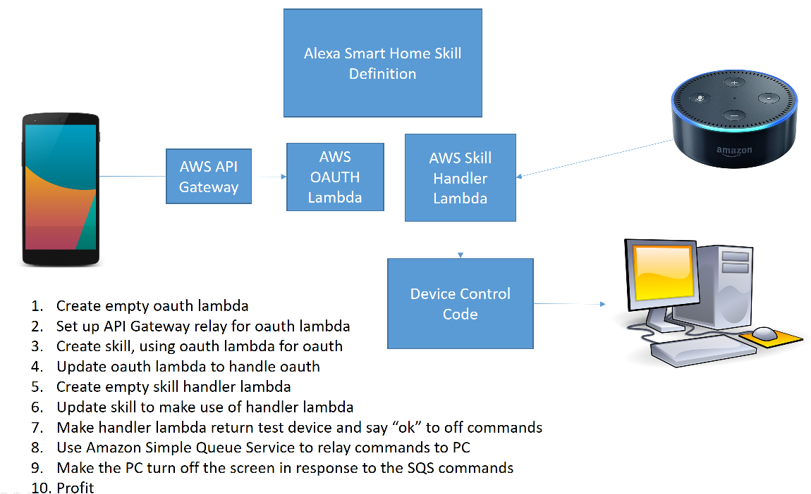

# AlexaSmartHomeDemo
This is the code associated with a live-coding session I recorded when I created an Amazon Echo Smart Home skill from scratch, in C#, making use of:
* AWS Lambdas (C#)
* AWS API Gateway
* AWS SQS
* The Alexa Smart Home definition UI
* A console app

The result is a smart home skill that lets you turn off your computer monitor using your Amazon Echo.

Once the live-coding session is uploaded I'll link to it from here.

